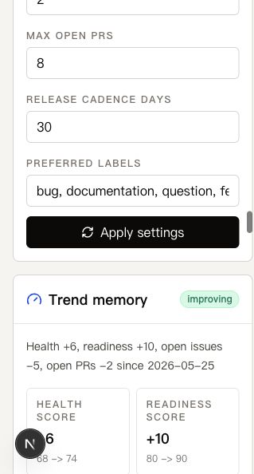

# OpenMaintainer

OpenMaintainer is an AI-native workbench for open-source maintainers. It helps maintainers inspect a public GitHub repository, triage issues, review pull requests, understand repository health, and draft release notes.

The product is English-first for global OSS maintainers and keeps a lightweight Chinese interface path for independent developers.



## Links

- Repository: https://github.com/maxiaoshenshen/openmaintainer
- Live preview: https://openmaintainer.vercel.app

## Why this exists

Maintainers spend a large amount of time on work that is critical but repetitive:

- Labeling and prioritizing issues
- Asking for missing reproduction details
- Reading large pull requests before review
- Drafting release notes
- Watching repository health and maintenance debt

OpenMaintainer makes that work visible in one cockpit. AI output is treated as a draft. Maintainers remain responsible for every label, reply, review, and release decision.

## Current MVP

- Repository input for `owner/repo` or GitHub URLs
- Demo mode that works without credentials
- Public GitHub repository fetcher
- Deterministic issue triage fallback
- Optional OpenAI-powered structured analysis
- Pull request review summaries and risk indicators
- Repository health score and next actions
- OSS readiness checklist
- Real repository quality signals for label coverage, response gaps, PR age, and review load
- Maintainer settings for per-project thresholds, release cadence, and preferred labels
- Trend memory for comparing current analysis with a previous repository snapshot
- Local snapshot store that remembers previous analyses in the browser
- Snapshot import/export for lightweight cross-browser and team handoff
- Similar issue cluster detection
- Copyable maintainer action plan for issues, pull requests, and release prep
- GitHub CLI handoff commands for maintainer-approved execution
- Repository playbooks for daily, weekly, and release maintenance rhythm
- Weekly maintainer digest with priorities, deferrals, and release readiness
- Release note draft generator
- Release draft copy and Markdown download
- English/Chinese UI switch

## Quick start

```bash
npm install
npm run dev
```

Open http://localhost:3000.

Try `demo` or a public GitHub repository such as `vercel/next.js`.

## Optional credentials

Copy `.env.example` to `.env.local`:

```bash
cp .env.example .env.local
```

Then add credentials as needed:

```bash
GITHUB_TOKEN=your_github_token
OPENAI_API_KEY=your_openai_key
OPENMAINTAINER_MODEL=gpt-5.4-mini
```

The app works without credentials. `GITHUB_TOKEN` raises GitHub API limits. `OPENAI_API_KEY` enables model-backed analysis through the OpenAI Responses API.

## Scripts

```bash
npm run test
npm run lint
npm run typecheck
npm run build
npm run validate
```

CI runs the same validation command on pushes to `main` and pull requests.

## Architecture

- `src/app` contains the Next.js App Router UI and route handlers.
- `src/components/dashboard.tsx` contains the interactive maintainer cockpit.
- `src/lib/maintainer-analysis.ts` contains deterministic triage, PR review, maintainer settings, health, and release-note logic.
- `src/lib/github.ts` contains GitHub repository parsing and fetch logic.
- `src/lib/openai-analyzer.ts` contains the optional OpenAI analysis path.

## Roadmap

See [ROADMAP.md](ROADMAP.md).

## Deployment

See [docs/deployment.md](docs/deployment.md).

## Contributing

See [CONTRIBUTING.md](CONTRIBUTING.md).

## License

MIT. See [LICENSE](LICENSE).
